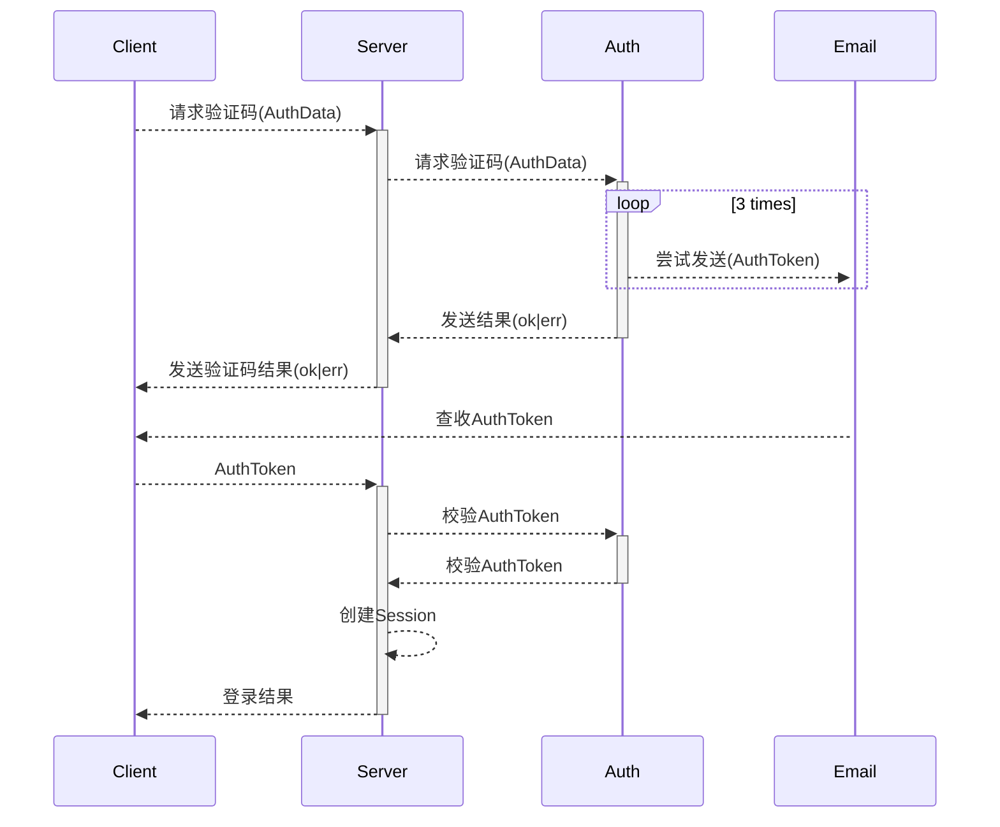

[beego] 如何开发CAPTCHA
========

```mermaid
sequenceDiagram
    participant Client 
    participant Server
    participant Auth
    participant Email
    Client-->>+Server: 请求验证码(AuthData)
    Server-->>+Auth: 请求验证码(AuthData)
    loop 3 times
        Auth-->>+Email: 尝试发送(AuthToken)
    end
    Auth-->>-Server: 发送结果(ok|err)
    Server-->>-Client: 发送验证码结果(ok|err)
    Email-->>Client: 查收AuthToken
    Client-->>+Server: AuthToken
    Server-->>+Auth: 校验AuthToken
    Auth-->>-Server: 校验AuthToken
    Server-->>Server: 创建Session
    Server-->>-Client: 登录结果
```

