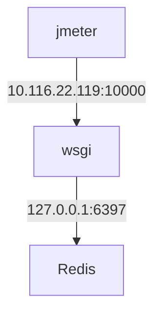

# HTTPServer性能测试

````{chart}
{
    "title": {
        "text": "测试结果对比图"
    },
    "tooltip" : {
        "trigger": "axis",
        "axisPointer": {
            "type": "shadow"
        }
    },
    "legend": {
        "data": ["GET", "POST", "SUM"]
    },
    "grid": {
        "left": "3%",
        "right": "4%",
        "bottom": "3%",
        "containLabel": true
    },
    "yAxis": [
        {
            "type" : "value"
        }
    ],
    "xAxis": [
        {
            "type": "category",
            "axisTick": {"show": false},
            "data": ["tornado", "openresty", "golang", "aiohttp", "sanic"]
        }
    ],
    "series": [
        {
            "name": "GET",
            "type": "bar",
            "itemStyle": {
                "normal": {
                    "label": {"show": true, "position": "inside"}
                }
            },
            "data":[678.75, 7734.03,  7775.66, 931.03,  1619.03]
        },
        {
            "name": "POST",
            "type": "bar",
            "itemStyle": {
                "normal": {
                    "label": {"show": true}
                }
            },
            "data":[678.83, 7735.35, 7775.75, 931.05, 1619.05]
        },
        {
            "name": "SUM",
            "type": "bar",
            "itemStyle": { "normal": {
                "label": { "show": true, "position": "left"}
            }},
            "data":[1357.58, 15469.38, 15551.41, 1862.08, 3238.08]
        }
    ]
}
````

## 测试架构



## tornado测试

### tornado测试代码

```python
#! /bin/python
from __future__ import print_function
from __future__ import unicode_literals
import concurrent.futures
import redis
from tornado import gen
import tornado.httpserver
import tornado.ioloop
import tornado.options
import tornado.web
import json
from tornado.web import asynchronous
from tornado.options import define, options
define("port", default=10000, help="run on the given port", type=int)
executor = concurrent.futures.ThreadPoolExecutor(2)

class Application(tornado.web.Application):
    def __init__(self):
        handlers = [(r"/tokens", TokenHandler),]
        settings = dict(debug=False)
        super(Application, self).__init__(handlers, **settings)

class BaseHandler(tornado.web.RequestHandler):
    pass

class TokenHandler(BaseHandler):
    r = redis.StrictRedis(host='127.0.0.1', port=6379)

    def get(self):
        token = self.r.spop('tokens')
        if token is not None:
            self.write(token)
        else:
            self.write('null')

    def post(self):
        data = json.loads(self.request.body.decode('utf8'))
        [self.r.sadd('tokens', x) for x in data]
        self.write('ok')


def main():
    tornado.options.parse_command_line()
    http_server = tornado.httpserver.HTTPServer(Application())
    http_server.listen(options.port)
    tornado.ioloop.IOLoop.current().start()
 
 
if __name__ == "__main__":
    main()
```

### tornado测试结果截图

- GET请求配置

- POST请求配置

- jmeter线程数配置

- tornado系统消耗

- GET请求测试结果

- POST请求测试结果


## openresty+lua测试 

### openresty测试代码

```nginx
worker_processes  1;

events {
    worker_connections  1024;
    use epoll;
}

lua_package_path '/usr/local/openresty/lualib/?.lua;;';
lua_package_cpath '/usr/local/openresety/lualib/?.so;;';

server {
    listen       10000;

    access_log  logs/tredis.access.log  main;

    lua_need_request_body on;

    location /tokens {

        content_by_lua_block {
                local cjson = require "cjson"
                local cjson2 = cjson.new()
                local cjson_safe = require "cjson.safe"

                local redis = require "resty.redis"
                local red = redis:new()

                red:set_timeout(1000) -- 1 sec

                -- or connect to a unix domain socket file listened
                -- by a redis server:
                --     local ok, err = red:connect("unix:/path/to/redis.sock")

                local ok, err = red:connect("127.0.0.1", 6379)
                if not ok then
                    ngx.say("failed to connect: ", err)
                    return
                end

                method_name = ngx.req.get_method()
                if (method_name == 'POST') then
                    local data = ngx.req.get_body_data()
                    data = cjson.decode(data)
                    for k, v in pairs(data) do
                        ok, err = red:sadd("token", v)
                        if not ok then
                            ngx.say("POST failed to set ", err)
                            return
                        end
                    end
                    ngx.say("set result: ", ok)
                end

                if (method_name == 'GET' ) then
                    local res, err = red:spop("token")
                    if not res then
                        ngx.say("GET failed ", err)
                        return
                    end
                    ngx.say(res)
                end

                local ok, err = red:set_keepalive(10000, 100)
                if not ok then
                    ngx.say("failed to set keepalive: ", err)
                    return
                end
                return
            }
        }
    location / {
        root html;
    }
}
```

### openresty测试结果截图

- openresty系统消耗

- GET请求测试结果

- POST请求测试结果


## golang测试

### golang测试代码

```golang
package main

import (
        "encoding/json"
        "fmt"
        "runtime"
        //"github.com/mediocregopher/radix.v2"
        "github.com/mediocregopher/radix.v2/pool"
        "github.com/mediocregopher/radix.v2/redis"
        //"io/ioutil"
        //"flag"
        "errors"
        "log"
        "net/http"
        "time"
)

func newPool() (*pool.Pool, error) {
        return pool.New("tcp", "127.0.0.1:6379", 10)
}

var (
        p *pool.Pool
)

func Handler(w http.ResponseWriter, r *http.Request) {
        var conn *redis.Client
        var err error
        err = errors.New("init")
        delta := 10 * time.Millisecond
        for err != nil {
                log.Println(err)
                if p.Avail() > 0 {
                        conn, err = p.Get()
                        continue
                }
                time.Sleep(delta)
                delta = delta * 2
        }
        defer p.Put(conn)
        if r.Method == "GET" {
                resp := conn.Cmd("SPOP", "tokens")
                if resp.Err != nil {
                        log.Println("GET error ", resp.Err)
                        fmt.Fprintf(w, "error")
                        return
                }
                token, err := resp.Str()
                if err != nil {
                        log.Println("GET error ", err)
                        fmt.Fprintf(w, "error")
                        return
                }
                log.Println("GET ok ", token)
                fmt.Fprintf(w, token)
                return
        }
        if r.Method == "POST" {
                var t []string
                r.ParseForm()
                for key, _ := range r.Form {
                        //LOG: {"test": "that"}
                        err := json.Unmarshal([]byte(key), &t)
                        if err != nil {
                                log.Println("json error ", err)
                                fmt.Fprintf(w, "error")
                                return
                        }
                }
                for _, v := range t {
                        resp := conn.Cmd("SADD", "tokens", v)
                        if resp.Err != nil {
                                log.Println("POST error ", resp.Err)
                                fmt.Fprintf(w, "error")
                                return
                        }
                        i, err := resp.Int()
                        if err != nil {
                                log.Println("POST error ", err)
                                fmt.Fprintf(w, "error")
                                return
                        }
                        log.Println("POST ok ", i)
                }
                fmt.Fprintf(w, "ok")
        }
}

func main() {
        runtime.GOMAXPROCS(1)
        p, _ = pool.New("tcp", "127.0.0.1:6379", 10)
        http.HandleFunc("/tokens", Handler)
        s := &http.Server{
                Addr:           ":10000",
                ReadTimeout:    30 * time.Second,
                WriteTimeout:   30 * time.Second,
                MaxHeaderBytes: 1 << 20,
        }
        log.Fatal(s.ListenAndServe())
}
```


### golang测试结果截图

- golang系统消耗

- GET请求测试结果

- POST请求测试结果


## aiohttp+aioredis 测试

### aiohttp测试代码

```python
from aiohttp import web
import asyncio
import aioredis

loop = asyncio.get_event_loop()

pool = None

async def get_pool():
    global pool
    if pool is None:
        pool = await aioredis.create_pool(
            ('127.0.0.1', 6379),
            minsize=1, maxsize=10)
    return pool

async def get_handler(request):
    pool = await get_pool()
    with await pool as conn:
        token = await conn.execute('spop', 'tokens')
    return web.Response(text='ok {0}'.format(token))

async def post_handler(request):
    pool = await get_pool()
    body = await request.json()
    with await pool as conn:
        for x in body:
            await conn.execute('sadd', 'tokens', x)
    print("POST {0}".format(body))
    return web.Response(text=body[0])


async def get_app():
    app = web.Application()
    app.router.add_get('/tokens', get_handler)
    app.router.add_post('/tokens', post_handler)
    return app


if __name__ == '__main__':
    app = loop.run_until_complete(get_app())
    web.run_app(app, host='0.0.0.0', port=10000)
```

### aiohttp测试结果截图

- aio系统消耗

- GET请求测试结果

- POST请求测试结果


## Sanic测试

### Sanic测试代码

```python
import sanic
from sanic import Sanic
import logging
import aioredis

logger = logging.getLogger(__name__)

async def setup(sanic, loop):
    sanic.conn = []
    sanic.redis = []
    for n in range(10):
        connection = await aioredis.Connection.create(host='127.0.0.1',
                                                           port=6379)
        sanic.redis.append(connection)

app = Sanic(name=__name__)


@app.listener('before_server_start')
async def before_server_start(app, loop):
    logger.info('Starting redis pool')
    app.redis_pool = await aioredis.create_pool(
        ('127.0.0.1', 6379),
        minsize=10,
        maxsize=10)


@app.listener('after_server_stop')
async def after_server_stop(app, loop):
    logger.info('Closing redis pool')
    app.redis_pool.close()
    await app.redis_pool.wait_closed()


@app.middleware('request')
async def attach_db_connectors(request):
    # Just put the db objects in the request for easier access
    logger.info('Passing redis pool to request object')
    request['redis'] = request.app.redis_pool


@app.route('/tokens', methods=['GET'])
async def get_tokens(request):
    '''Check to see if the value is in cache, if so lets return that'''
    try:
        with await request['redis'] as redis_conn:
            token = await redis_conn.execute('spop', 'tokens')
        return sanic.response.HTTPResponse(token, status=200)
    except aioredis.ProtocolError:
        logger.critical('Unable to connect to state cache')
        return sanic.response.HTTPResponse('error', status=500)


@app.route('/tokens', methods=['POST'])
async def post_tokens(request):
    tokens = request.json
    try:
        with await request['redis'] as redis_conn:
            for x in tokens:
                await redis_conn.execute('sadd', 'tokens', x)
        return sanic.response.HTTPResponse('ok', status=200)
    except aioredis.ProtocolError:
        logger.critical('Unable to connect to state cache')
        return sanic.response.HTTPResponse('error', status=500)


if __name__ == '__main__':
    app.run(host='0.0.0.0', port=10000)
```

### Sanic测试结果截图

- sanic系统消耗

- GET请求测试结果

- POST请求测试结果

